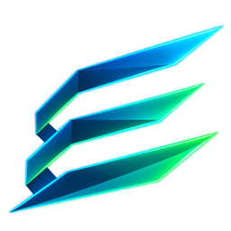

# Project Echelon

  

**Minecraft, refined.**

Project Echelon is a work-in-progress Windows launcher and fair-play client for Minecraft: Java Edition. It is focused on performance, clarity, personalization, and quality-of-life features without adding combat cheats, movement exploits, automation, X-ray, or other unfair advantages.

## Project status

Project Echelon is currently in active development. The launcher interface, local launcher-profile protection, settings, account management, and Microsoft sign-in experience are being built first. Minecraft launching and distribution are not yet available.

## Planned experience

- A polished Windows launcher built around a liquid-glass interface
- Secure Microsoft account sign-in through Microsoft's own authentication interface
- Verification of legitimate Minecraft: Java Edition ownership
- Multiple Microsoft/Minecraft account profiles
- Performance, HUD, and utility modules designed for fair play
- Game-version, profile, display, runtime, and accessibility settings
- An in-game configuration interface for Project Echelon modules

## Microsoft and Minecraft authentication

Project Echelon uses Microsoft's official authentication flow. Microsoft handles the user's password, security keys, and account verification. Project Echelon never asks users to type their Microsoft password into the launcher and does not receive or store Microsoft passwords.

The intended sign-in chain is:

1. Microsoft account authentication
2. Xbox Live user authentication
3. XSTS authorization
4. Minecraft Services authentication
5. Minecraft: Java Edition ownership and profile verification

Project Echelon uses its own registered Microsoft Entra Application ID and does not impersonate another launcher or reuse another application's credentials.

## Fair-play direction

Project Echelon is not a hacked client. Its module catalogue is limited to legitimate performance, HUD, accessibility, visual-clarity, and quality-of-life features. Features intended to automate gameplay or provide an unfair competitive advantage are outside the project's direction.

Read the full [fair-play statement](FAIR_PLAY.md).

## Privacy and security

Account authentication is performed by Microsoft. Sensitive local account information is protected using Windows account-bound storage. Project Echelon does not operate an advertising or analytics platform and does not sell user information.

Read the current [privacy overview](PRIVACY.md).

## Availability

Project Echelon is not publicly released yet. This repository currently exists to document the project, its authentication design, and its fair-play scope while development continues.

## Contact

Questions about Project Echelon can be submitted through this repository's Issues page.

## Independence notice

Project Echelon is an independent project and is not affiliated with, endorsed by, or sponsored by Mojang Studios or Microsoft. Minecraft is a trademark of Microsoft Corporation.

